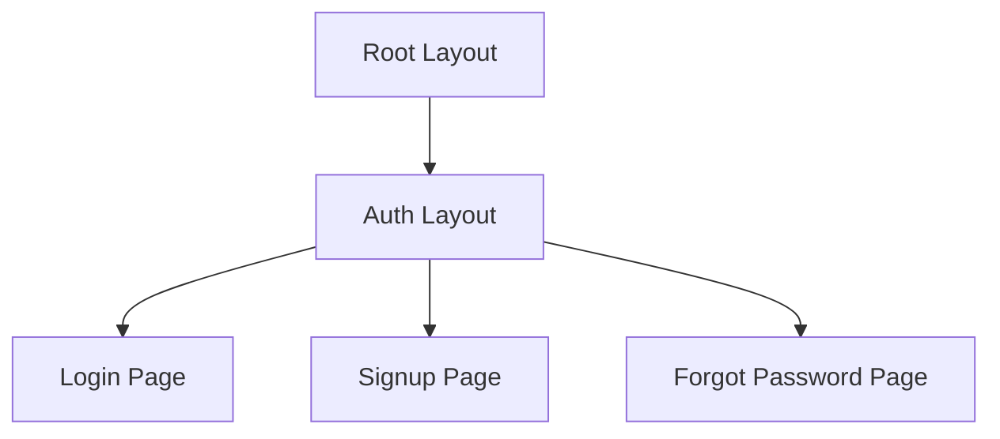
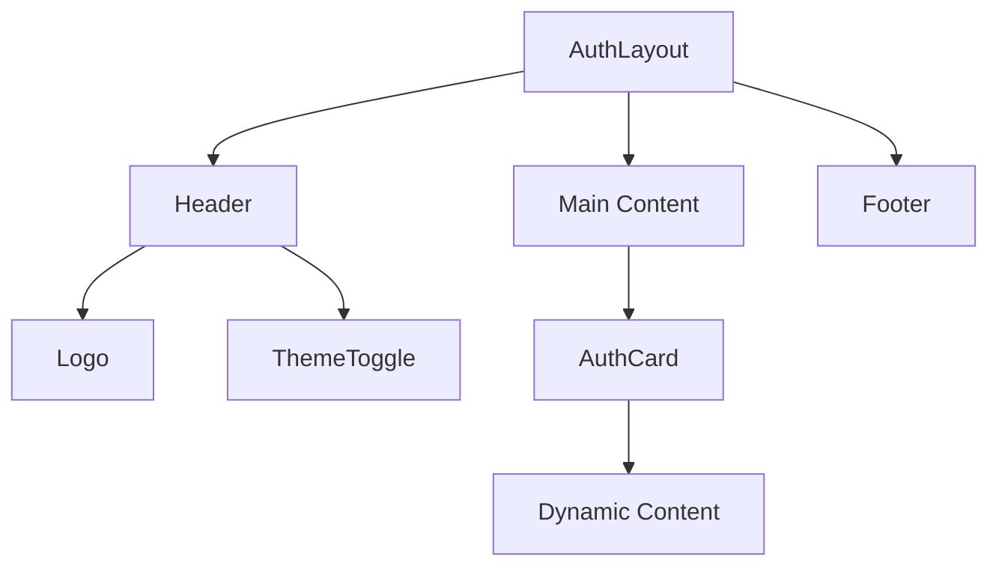
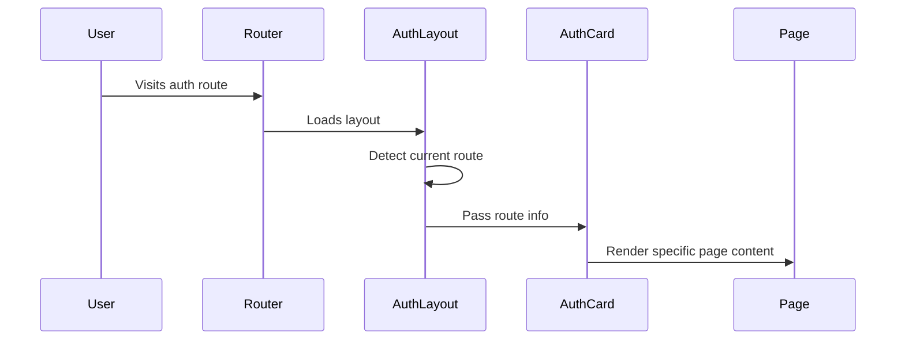

# Next.js Auth Layout Explanation

## Overview
The auth layout (`app/(auth)/layout.tsx`) serves as a template for all authentication-related pages in the application. Let's break down its structure and functionality.

## Layout Structure



## Component Hierarchy



## Key Components

### 1. Route Detection
```typescript
const pathname = typeof window !== 'undefined' ? window.location.pathname : '/login'
const currentRoute = Object.values(routes).find(route => route.path === pathname) || routes.login
```
- Checks if code is running in browser
- Defaults to '/login' during server-side rendering
- Matches current path with routes configuration

### 2. Layout Structure
The layout consists of three main sections:

#### Header

```16:23:app/(auth)/layout.tsx
      <header className="sticky top-0 z-50 w-full border-b bg-background/95 backdrop-blur supports-[backdrop-filter]:bg-background/60">
        <div className="container flex h-16 items-center justify-between">
          <div className="flex items-center gap-2">
            <div className="text-2xl font-bold">Auth System</div>
          </div>
          <ThemeToggle />
        </div>
      </header>
```

- Sticky positioning
- Contains app title and theme toggle
- Semi-transparent background with blur effect

#### Main Content

```24:31:app/(auth)/layout.tsx
      <main className="flex-1 flex items-center justify-center p-6">
        <AuthCard 
          title={currentRoute.title}
          description={currentRoute.description}
        >
          {children}
        </AuthCard>
      </main>
```

- Centered content
- Wraps content in AuthCard component
- Dynamic title and description based on route

#### Footer

```32:36:app/(auth)/layout.tsx
      <footer className="border-t py-4">
        <div className="container text-center text-sm text-muted-foreground">
          © {new Date().getFullYear()} Auth System. All rights reserved.
        </div>
      </footer>
```

- Copyright information
- Year updates dynamically

## Flow Diagram



## Styling Features

1. **Responsive Design**
   - Uses Flexbox for layout
   - Full viewport height (`min-h-screen`)
   - Centered content alignment

2. **Theme Support**
   - Background colors from theme
   - Muted text colors
   - Blur effects for header

3. **Container Structure**
```
┌─────────────────────────┐
│        Header           │
├─────────────────────────┤
│                         │
│                         │
│      Auth Card          │
│                         │
│                         │
├─────────────────────────┤
│        Footer           │
└─────────────────────────┘
```

## Integration Points

1. **Theme System**
   - Integrates with `ThemeToggle` component
   - Uses theme-aware background classes

2. **Routing System**
   - Works with Next.js routing
   - Handles route information via `routes` object

3. **Content Injection**
   - Uses React's children prop for page content
   - Wraps content in `AuthCard` component

## Usage Example

When a user visits `/login`, the layout:
1. Detects the current route
2. Loads appropriate title/description
3. Renders the login page content within the `AuthCard`
4. Maintains consistent header/footer across auth pages

This layout ensures a consistent user experience across all authentication-related pages while maintaining clean separation of concerns and reusable components.